<div align="center">

# dotfiles

**A Tokyo Night desktop on CachyOS + Hyprland, built around coding agents.**

Riced after [Omarchy](https://github.com/basecamp/omarchy), with tools of its own: a tmux workspace for coding agents, GTK panels in one look, workspace groups and a live code backup. One repo, every PC the same.

[](https://cachyos.org) [](https://hyprland.org) [](https://github.com/tmux/tmux) [](https://gtk.org) [](https://github.com/folke/tokyonight.nvim)

[**agentmux**](#agentmux) &nbsp;·&nbsp; [**Panels**](#panels) &nbsp;·&nbsp; [**Themes**](#colour-themes) &nbsp;·&nbsp; [**Also inside**](#also-inside) &nbsp;·&nbsp; [**Install**](#install) &nbsp;·&nbsp; [**Keys**](#keys) &nbsp;·&nbsp; [**Manual**](MANUAL.md)

<br>

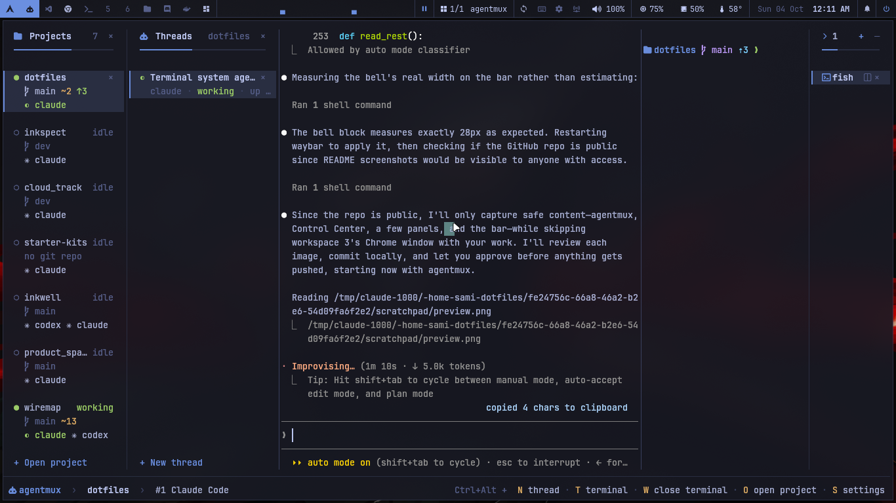


</div>

<br>

<h2 align="center">agentmux</h2>

<p align="center"><code>Super + A</code> · a workspace for coding agents, by project: Projects · Threads · the agent · terminals</p>

<table>
  <tr>
    <td width="33%" align="center" valign="top"><b>Any agent, any number</b><br><sub>Claude Code, Codex, opencode and agy, as many threads as you like in one project.</sub></td>
    <td width="33%" align="center" valign="top"><b>Live in two places</b><br><sub>Each thread is a tmux session shared with the kitty beside VS Code: one agent, two views.</sub></td>
    <td width="33%" align="center" valign="top"><b>Knows what they're doing</b><br><sub>Needs you, working, done or error, from the agents' own hooks, with a notification when it matters.</sub></td>
  </tr>
  <tr>
    <td align="center" valign="top"><b>Picks up where you left off</b><br><sub>After a restart every thread comes back on its own conversation.</sub></td>
    <td align="center" valign="top"><b>Terminals like VS Code's</b><br><sub>Each one full height, a thin list at the side, split when you need two.</sub></td>
    <td align="center" valign="top"><b>Yours to arrange</b><br><sub>Any panel full width with <code>Ctrl+Alt+Z</code>, panels hide and resize, every key remappable.</sub></td>
  </tr>
</table>

<p align="center"><a href="MANUAL.md#agents-agentmux">Everything about agentmux →</a></p>

<br>

<h2 align="center">Panels</h2>

<p align="center">GTK 4 windows in one look. A key or a click on the bar opens one; the same key or <code>Esc</code> closes it.</p>

<table>
  <tr>
    <td width="50%">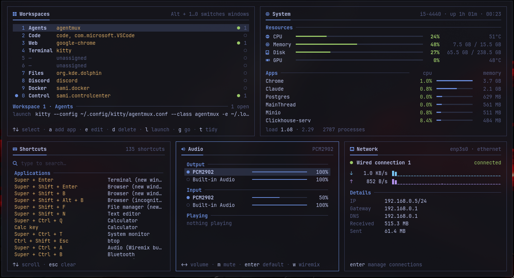</td>
    <td width="50%">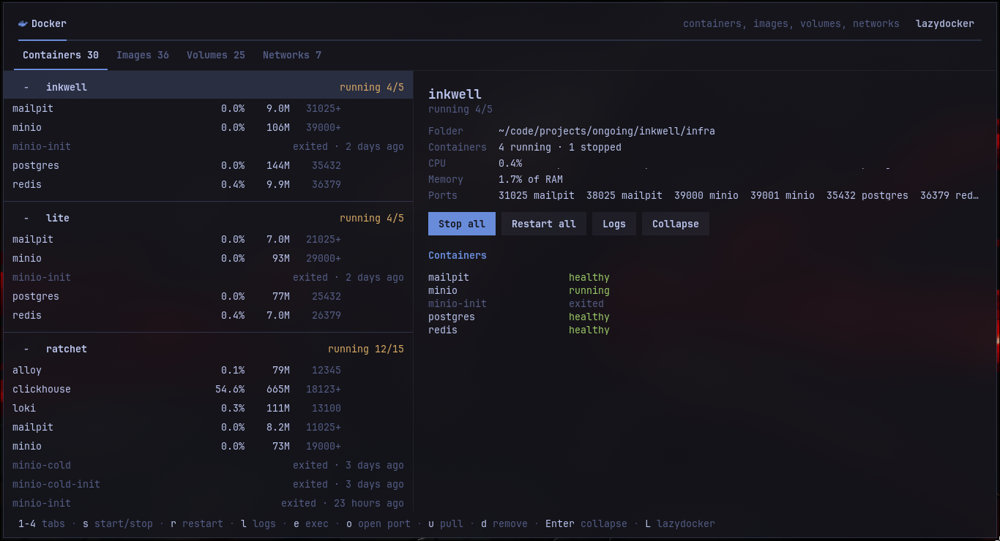</td>
  </tr>
  <tr>
    <td align="center"><b>Control Center</b> &nbsp;<sub>workspace 10</sub><br><sub>Workspaces, system, shortcuts, audio and network.</sub></td>
    <td align="center"><b>Docker</b> &nbsp;<sub>workspace 9</sub><br><sub>Compose projects, images, volumes and networks.</sub></td>
  </tr>
  <tr>
    <td>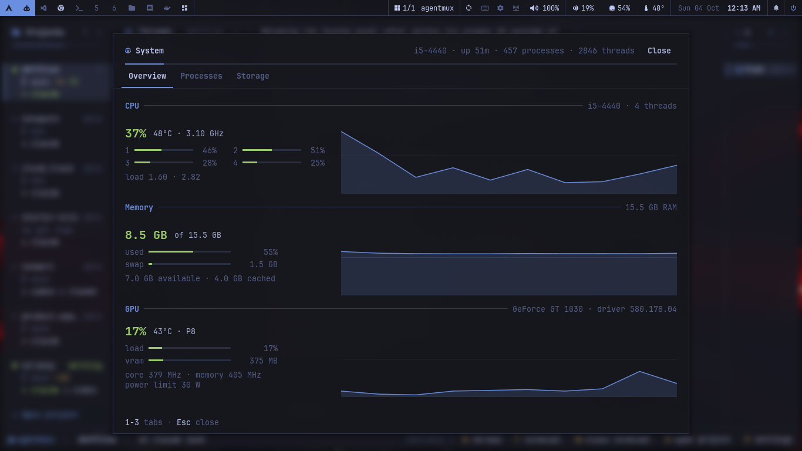</td>
    <td>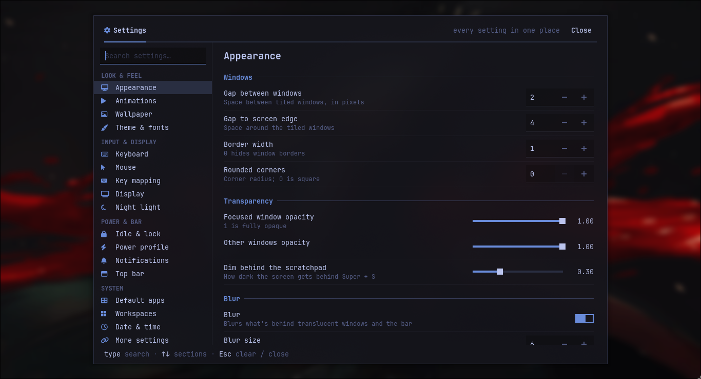</td>
  </tr>
  <tr>
    <td align="center"><b>System</b> &nbsp;<sub><code>Super + Ctrl + T</code></sub><br><sub>CPU, memory and GPU history, processes, storage.</sub></td>
    <td align="center"><b>Settings</b> &nbsp;<sub><code>Super + I</code></sub><br><sub>Every setting of the desktop in one place, searchable.</sub></td>
  </tr>
  <tr>
    <td>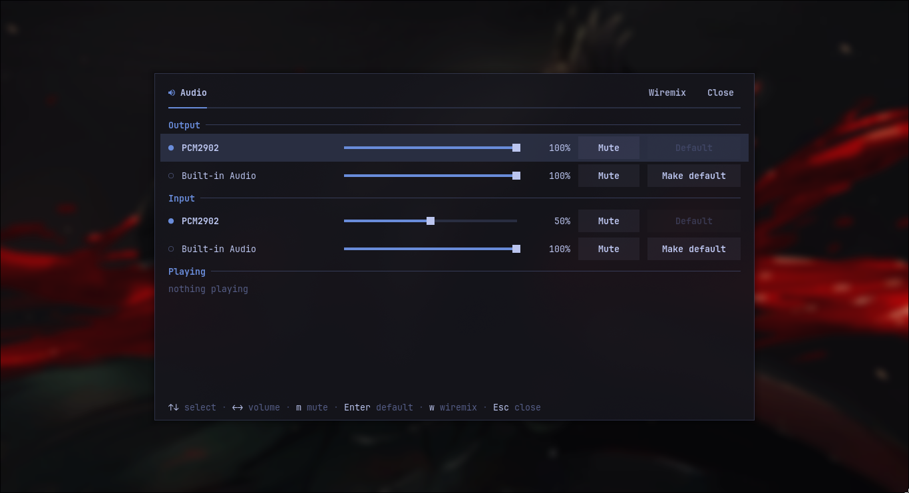</td>
    <td>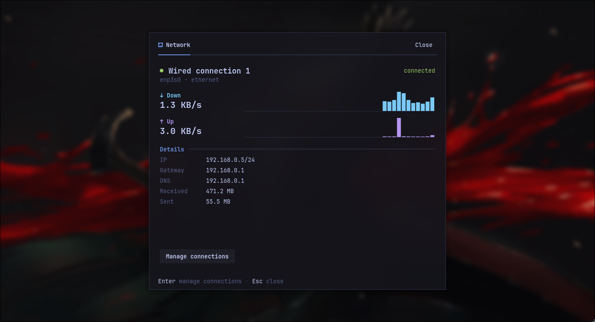</td>
  </tr>
  <tr>
    <td align="center"><b>Audio</b> &nbsp;<sub><code>Super + Ctrl + A</code></sub><br><sub>Outputs and inputs, volume, mute, default device.</sub></td>
    <td align="center"><b>Network</b> &nbsp;<sub><code>Super + Ctrl + W</code></sub><br><sub>The connection, live traffic and addresses.</sub></td>
  </tr>
  <tr>
    <td>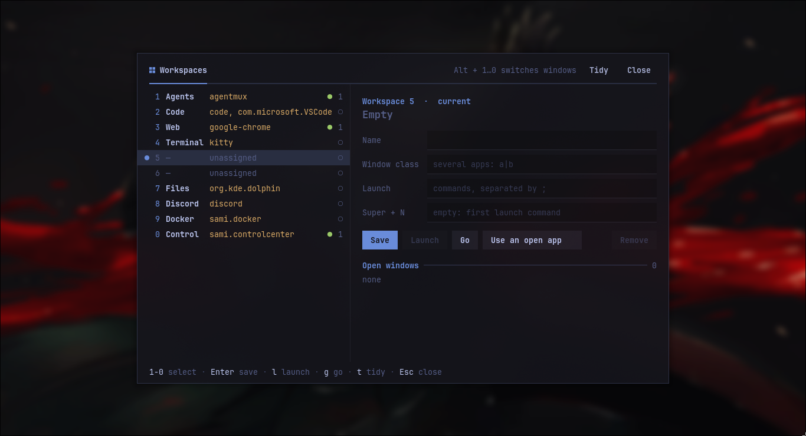</td>
    <td>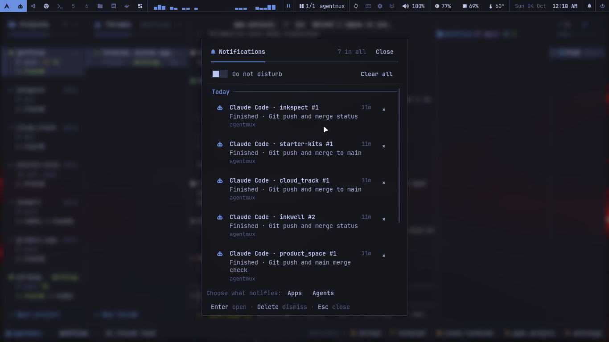</td>
  </tr>
  <tr>
    <td align="center"><b>Workspaces</b> &nbsp;<sub><code>Super + Ctrl + G</code></sub><br><sub>Which app each workspace is for; launch or go.</sub></td>
    <td align="center"><b>Notifications</b> &nbsp;<sub><code>Super + .</code></sub><br><sub>History by day, do not disturb, what notifies.</sub></td>
  </tr>
</table>

<p align="center"><a href="MANUAL.md#panels">All the panels →</a></p>

<br>

<h2 align="center">Colour themes</h2>

<p align="center"><code>Super + Shift + T</code> · one theme for the whole desktop: bar, borders, terminals, panels, launcher, notifications</p>

<table>
  <tr>
    <td width="50%">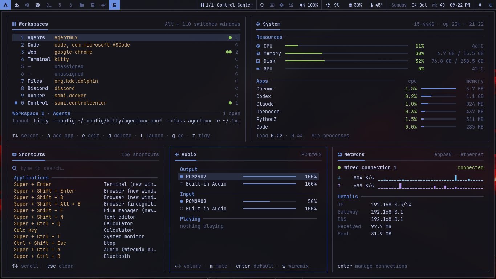</td>
    <td width="50%">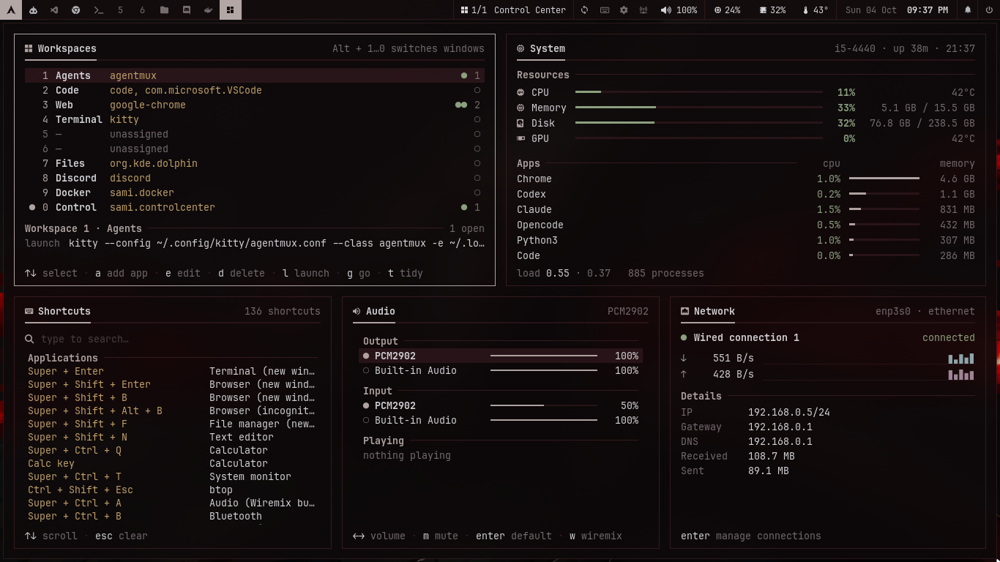</td>
  </tr>
  <tr>
    <td align="center"><b>Tokyo Night</b><br><sub>Deep blue-black with a soft blue accent.</sub></td>
    <td align="center"><b>Crimson</b><br><sub>Oxblood almost black, a silver accent; red only for alerts.</sub></td>
  </tr>
</table>

<p align="center"><a href="MANUAL.md#colour-themes-tokyo-night-crimson">How themes work, and making one →</a></p>

<br>

<h2 align="center">Also inside</h2>

<p align="center">The rest of what makes it one desktop on every PC.</p>

<table>
  <tr>
    <td width="33%" align="center" valign="top"><b>Workspace groups</b><br><sub>One workspace per kind of app, each opened or focused with one key.</sub><br><sub><a href="MANUAL.md#workspace-groups">More →</a></sub></td>
    <td width="33%" align="center" valign="top"><b>codesync</b><br><sub>The code folder backed up from the SSD to the HDD as you work.</sub><br><sub><a href="MANUAL.md#code-backup-codesync">More →</a></sub></td>
    <td width="33%" align="center" valign="top"><b>Every PC the same</b><br><sub>Packages, agents and settings from the repo; <code>dotsync</code> keeps them in step.</sub><br><sub><a href="MANUAL.md#syncing-between-pcs">More →</a></sub></td>
  </tr>
</table>

<br>

<h2 align="center">Install</h2>

<p align="center">On a fresh CachyOS with Hyprland:</p>

```bash
git clone https://github.com/sami999khan999/arch_dotfiles.git ~/dotfiles
cd ~/dotfiles
setup/install.sh --packages   # packages, toolchains, coding agents, config links
```

<p align="center">Log out and back in. The one-time root steps (login screen, boot splash, swap) are listed at the end:<br><a href="MANUAL.md#bootstrap-a-new-machine">Bootstrap a new machine →</a></p>

<br>

<h2 align="center">Keys</h2>

<p align="center">The ones to know first.</p>

<table align="center">
  <tr>
    <td align="center"><code>Super + A</code></td><td>agentmux</td>
    <td align="center"><code>Super + K</code></td><td>every shortcut, searchable</td>
  </tr>
  <tr>
    <td align="center"><code>Super + I</code></td><td>Settings</td>
    <td align="center"><code>Super + .</code></td><td>notifications</td>
  </tr>
  <tr>
    <td align="center"><code>Super + Ctrl + T</code></td><td>System</td>
    <td align="center"><code>Alt + 1…0</code></td><td>the Nth window of the workspace</td>
  </tr>
</table>

<p align="center"><a href="MANUAL.md#shortcut-list">Shortcut list →</a></p>

<br>

<div align="center">
<sub>Tokyo Night colours · square corners · JetBrains Mono everywhere &nbsp;|&nbsp; <a href="MANUAL.md">Read the full manual</a></sub>
</div>
